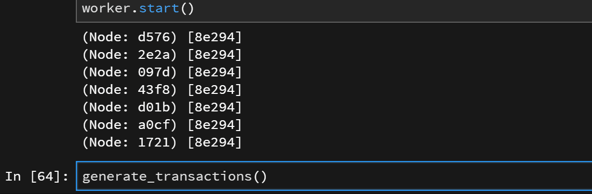

# Python で Blockchain の実装をする

# 概要

- [Bitcoin 論文](https://bitcoin.org/bitcoin.pdf)を参考に blockchain の実装をする
  - 天下り的にならないよう，徐々にシステムをパワーアップさせていく方針で作る
- 目標は，参加者同士が競ってマイニングをし，コンセンサスを取りながらblockchainを作る様子を眺めること
  - 完成形はこんな感じ
    

- 本記事の実装はこちら (Jupyter Notebook)： https://github.com/tamuhey/python_blockchain


※ Jupyterでの実装推奨

# 信用のある第三者を介する取引

- まずは第三者を介した取引をシミュレーションしてみる
- 第三者は取引の公正さのすべてを請け負う

## 取引はどのように行うか? - Transaction の実装

- 取引記録を発行することで，取引を行う
  - Python3.7 から実装された[dataclasses](https://docs.python.org/ja/3/library/dataclasses.html#)を使ってみる

```python
from __future__ import annotations
from dataclasses import dataclass
```

- 個人の識別を`address`で行う
- 取引額を`value`とする

```python
@dataclass
class Transaction:
    sender_address: int
    receiver_address: int
    value: float
```

- sender は Transaction を発行して取引を行う

## Wallet の実装

- とりあえず，Wallet は適当な 1 つの`int`を address として持つことにする
- Transaction を発行する機能をもたせる
  - `send` method で取引記録を作成できる

```python
@dataclass
class Wallet:
    address: int
    def send(self, receiver_address, value):
        return Transaction(self.address, receiver_address, value)
```

## Ledger の実装

- transaction は信用のある第三者(Bank と呼ぶことにする)に提出されることで成立する
  - Bank は Transaction を元帳(Ledger)で管理する
  - Bank が全ての Transaction を管理し，精査することで不正を防止する
- Ledger はとりあえず単なるリストにする

```python
Ledger=list
```

## デモ: シンプルな取引

- Alice と Bob が取引する様子をデモする

```python
alice=Wallet(1) # create Alice's wallet
bob=Wallet(2)   # create Bob's wallet
ledger=Ledger() # create Bank's ledger
```

- Alice が transaction を発行して Bank に登録することで，取引が成立する

```python
transaction=alice.send(bob.address, 5) # Alice send `5` to Bob
ledger.append(transaction)
```

- ここで例えば，第三者の信頼度がちょっと落ちたとする
  - 取引内容の改ざんはどのように防げばよいだろうか?

# 電子署名を用いた transaction の発行

- sender は transaction に電子署名を行う
  - 今回は RSA を用いることにする
    - BitCoin は[ECDSA](https://en.bitcoin.it/wiki/Transaction#Input)を用いている
  - これによって transaction の改ざんを検知することができる
- 電子署名の公開鍵はどのように扱う?
  - 公開鍵を Wallet の address とする!

## Transaction の改良 - 電子署名フィールドの追加

- 電子署名できるようにする
  - `sign`を追加
  - 署名の際，transaction を str で表すための`str_data` method も追加
- ついでにデータを json string に変換する method を追加する
  - これは後々データのやり取りを簡単にするため

```python
import json
import dataclasses as dc
```

```python
@dataclass
class Transaction:
    sender_address: str
    receiver_address: str
    value: float
    sign: str = None

    def str_data(self) -> str:
        # return the str of data without `sign`
        d=dc.asdict(self)
        del d["sign"]
        return json.dumps(d)

    def json_dumps(self) -> str:
        return json.dumps(dc.asdict(self))
    @classmethod
    def json_loads(cls, string) -> Transaction:
        return cls(**json.loads(string))
```

## Wallet の改良 - 電子署名機能の追加

- RSA による電子署名機能を実装する
  - pycrypto を用いる
    - 使い方はこれを参照 ([python \- Signing and verifying data using pycrypto \(RSA\) \- Stack Overflow](https://stackoverflow.com/questions/4232389/signing-and-verifying-data-using-pycrypto-rsa))
- 引き続き Wallet は address を 1 つのみ持つことにする
  - 例えば BitCoin では匿名性の向上のため，一つの Wallet は複数のキーペアを持つことができる ([参考](https://en.bitcoin.it/wiki/Transaction))

```python
from Crypto.Signature import PKCS1_v1_5
from Crypto.Hash import SHA
from Crypto.PublicKey import RSA
import binascii
```

- pycrypto の key instance を str に変換する helper function を実装する
  - str にしておく理由は後ほどわかる

```python
def decode_key(key):
    if isinstance(key, str):
        return key
    return binascii.hexlify(key.exportKey(format='DER')).decode('ascii')
def encode_key(key):
    if isinstance(key, RSA._RSAobj):
        return key
    return RSA.importKey(binascii.unhexlify(key))
```

Wallet の改良

```python
class Wallet:
    def __init__(self):
        key=RSA.generate(1024)
        self.private_key = decode_key(key)
        self.address = decode_key(key.publickey())

    def sign_transaction(self, transaction) -> Transaction:
        # generate signer from self private key
        signer=PKCS1_v1_5.new(encode_key(self.private_key))
        # hash the transaction
        h=SHA.new(transaction.str_data().encode())
        # add signature to the transaction, and return it
        return dc.replace(transaction, sign=signer.sign(h).hex())

    def send(self, receiver_address, value) -> Transaction:
        """Generate transaction, and add signature"""
        transaction=Transaction(self.address, receiver_address, value)
        return self.sign_transaction(transaction)
```

- 秘密鍵`private_key`の追加
- address は対応する公開鍵とする
- `sign_transaction`の追加
  - transaction を受け取り，電子署名付き transaction を返す
- `send`を変更
  - 電子署名付き transaction を生成できるようになった!

ついでに，transaction の電子署名をチェックする helper function を作る

- signature の public key は transaction の address なので，transaction を見れば電子署名の正当性を判別できる

```python
def verify_transaction(transaction) -> bool:
    if transaction.sign is None:
        return False
    # hash the transaction
    h=SHA.new(transaction.str_data().encode())
    # generate verifier with public key
    verifier=PKCS1_v1_5.new(encode_key(transaction.sender_address))
    # is the signature correct?
    return verifier.verify(h, binascii.unhexlify(transaction.sign))
```

## デモ: RSA を用いた transaction の発行とチェック

先ほどと同じようにデモをしてみる

```python
alice=Wallet() # now the address is automatically generated
bob=Wallet()
ledger=Ledger()
```

- transaction を発行し，電子署名を行い，bank に提出する

```python
transaction=alice.send(bob.address, 5)
# Bank appends the transaction to its ledger
ledger.append(transaction)
```

- transaction の電子署名を確認してみる

```python
verify_transaction(transaction)
```

    True

- データをちょと変えてみると，不正な transaction になるのがわかる

```python
transaction.value=7
verify_transaction(transaction)
```

    False

- transaction の改竄リスクを低減することができた
  - しかし依然として，**double-spending problem** を防ぐには信頼のある第三者が必要となる
  - これはデータで通貨を作る際の最も大きな障害(データは簡単にコピーできるから)
- すべての transaction が公開されていれば，double-spending は防げるのでは？
  - 公開されていれば receiver も記録をチェックできる

# Timestamp Server による Transaction の公開

- いくつかの transaction をまとめて，timestamp をつけ，**block**で公開することを考える
  - 信頼のある**timestamp server**が transaction をまとめて timestamp をつけ，電子署名をして公開する
  - ある特定の時刻にその transaction が存在したことが保証される
- さらに，block には直前の timestamp の hash を含め，**blockchain**を作る
  - block を改ざんすると，以降の block は全て不正なものとなる
- これで transaction をチェックして double-spending を防ぐ第三者は必要なくなった
  - transaction は公開されているから，誰でも検証することができる

## Block の実装

- str で表現できるよう，json method を追加する
- ついでに hash method も実装する

```python
from typing import Tuple, Sequence
import hashlib
```

```python
@dataclass
class Block:
    time: float
    transactions: Tuple[Transaction]
    previous_hash: str
    sign: str = None

    def json_dumps(self) -> str:
        dct=dc.asdict(self)
        dct["transactions"]=[t.json_dumps() for t in self.transactions]
        return json.dumps(dct)
    @classmethod
    def json_loads(cls, string) -> Block:
        dct=json.loads(string)
        dct["transactions"]=tuple([Transaction.json_loads(t) for t in dct["transactions"]])
        return cls(**dct)

    def hash(self) -> str:
        block_bytes=self.json_dumps().encode()
        return hashlib.sha256(block_bytes).hexdigest()
```

## Timestamp Server の実装

- timestamp server は以下の流れで**blockchain**を作る

  1. transaction のリストを受け取る
  2. 一つ前の block の hash と timestamp をつけて Block にまとめる
  3. **電子署名**をする
  4. 公開する

- block の正当性の保証は timestamp server の**電子署名**で行う
  - server に RSA キーペアをもたせる
- 最初の block は previous block がないため，特別なブロック(**genesis**)を用意する ([参考](https://en.bitcoin.it/wiki/Genesis_block))
- blockchain は今回はただのリストにする

```python
from time import time
```

```python
class TimestampServer:
    def __init__(self):
        key=RSA.generate(1024)
        self.public_key=key.publickey()
        self.signer=PKCS1_v1_5.new(key)

        genesis=Block(time(), (), "0")
        self.block_chain=[genesis]

    def generate_block(self, transactions: Sequence[Transaction]):
        # generate block
        block=Block(time(), tuple(transactions), self.block_chain[-1].hash())

        # sign the block
        dct=dc.asdict(block)
        del dct["sign"]
        block.sign=self.signer.sign(SHA.new(json.dumps(dct).encode())).hex()

        # publish the block
        self.block_chain.append(block)
```

## blockchain の正当性確認

- blockchain の正当性を確認する helper function を用意する

  1. block の持つ**previous_hash**は正しいか?
  2. block に入っている transaction は正当か?
  3. timestamp server がつけた電子署名は正当か?

- block の正当性確認

```python
def verify_block(previous_block, block, timestamp_server_publickey) -> bool:
    is_correct_hash = previous_block.hash() ==  block.previous_hash
    is_correct_transactions = all(map(verify_transaction, block.transactions))

    dct=dc.asdict(block)
    del dct["sign"]
    h=SHA.new(json.dumps(dct).encode())
    verifier=PKCS1_v1_5.new(timestamp_server_publickey)
    is_correct_sign=verifier.verify(h, binascii.unhexlify(block.sign))
    return is_correct_hash and is_correct_transactions and is_correct_sign
```

- blockchain の正当性確認

```python
def verify_blockchain(chain, timestamp_server_publickey):
    for i in range(len(chain)-1):
        if not verify_block(chain[-i-2],chain[-i-1],timestamp_server_publickey):
            return False
    return True
```

## デモ: Timestamp server による Block の公開と BlockChain への登録

- timestamp server をつくる

```python
timestamp_server=TimestampServer()
```

- 取引を複数回行う

```python
transactions=[]
transactions.append(alice.send(bob.address, 5))
transactions.append(bob.send(alice.address, 7))
```

- Timestamp server による Block の生成と公開
  - timestamp_server の blockchain は**誰でも見ることができる**

```python
timestamp_server.generate_block(transactions)
```

- 正当性確認

```python
verify_blockchain(timestamp_server.block_chain, timestamp_server.public_key)
```

    True

- これで transaction のチェックをすべての人が行えるようになった
- 確かにtransaction を検証する第三者は必要なくなったが，今度は信頼のある timestamp server が必要になってしまった
- **timestamp server を第三者に任せない方法がほしい!**

# Proof-of-Work の実装

- これが blockchain の革新的要素
- 先程は"信頼の置ける" timestamp server の電子署名が，Block の正当性を保証していた
- では誰でも同じ署名ができれば，誰でも timestamp server の仕事ができるのでは?
  - 電子署名でやると，当然ブロックの正当性の証明にはならない..
- [HashCash](https://en.bitcoin.it/wiki/Hashcash)を用いる

## Block に nonce を加える

- これが timestamp server の電子署名の代わりとなる
- block のハッシュ値が適当な条件を満たすように**nonce**を追加する
  - 例えば上 4 桁が 0
  - この制約を**difficulty**と呼ぶ
  - difficulty は適当に調整される. 例えば bitcoin の場合は，block の追加の interval が 10 分程度になるように調整されるようだ
    - [Difficulty \- Bitcoin Wiki](https://en.bitcoin.it/wiki/Difficulty)
  - 今回は difficulty は固定にする
- nonce を見つける作業が**mine**
  - nonce を見つけるのは難しい(たくさん試して，あたりを引くしかない)
    - これによって block の生成を非常に高コストにすることができる
  - nonce が正しいことを確認するのは簡単
    - 電子署名と同様, 正当性の確認が簡単に行える
- **mine**は誰でも行える

Block に nonce をつける

```python
@dataclass
class Block:
    time: float
    transactions: Tuple[Transaction]
    previous_hash: str
    nonce: int = None

    def json_dumps(self) -> str:
        dct=dc.asdict(self)
        dct["transactions"]=[t.json_dumps() for t in self.transactions]
        return json.dumps(dct)

    @classmethod
    def json_loads(cls, string) -> Block:
        dct=json.loads(string)
        dct["transactions"]=tuple([Transaction.json_loads(t) for t in dct["transactions"]])
        return cls(**dct)

    def hash(self):
        block_bytes=self.json_dumps().encode()
        return hashlib.sha256(block_bytes).hexdigest()
```

## nonceの検証コード
- blockのnonceは正しいか?

```python
difficulty=3
def valid_proof(block):
    return block.hash()[:difficulty] == "0" * difficulty
```

## mine の実装

- あたりを引くまで手当たり次第試す

```python
def mine(block):
    nonce=0
    block.nonce=nonce
    while not valid_proof(block):
        nonce += 1
        block.nonce=nonce
    return block
```

- ついでに verify_block も改良
    1. `previous_hash`は正しいか？
    2. transactionは正当か？
    3. nonceは正しいか？

```python
def verify_block(previous_block, block) -> bool:
    is_correct_hash = previous_block.hash() ==  block.previous_hash
    is_correct_transactions = all(map(verify_transaction, block.transactions))
    is_correct_proof = valid_proof(block)
    return is_correct_hash and is_correct_transactions and is_correct_proof
```

- BlockChain もちょっと改良
  - 自身を str に変換する method をつける

```python
class BlockChain(list):
    def json_dumps(self) -> str:
        return json.dumps([block.json_dumps() for block in self])
    @classmethod
    def json_loads(cls, string) -> BlockChain:
        return cls([Block.json_loads(s) for s in json.loads(string)])
```

## デモ: tranasction の発行から mining まで

```python
genesis=Block(time(), (), "0")
block_chain=BlockChain([genesis])

# 取引
transactions=[]
transactions.append(alice.send(bob.address, 5))
transactions.append(bob.send(alice.address, 5))
```

- mine

```python
previous_hash=block_chain[-1].hash()
block=mine(Block(time(), tuple(transactions), previous_hash))
```

```python
block.nonce
```

    2523

- かなり遅い実装をしているので，そこそこ時間がかかるかもしれない
- block を検証してみる

```python
verify_block(block_chain[-1], block)
```

    True

# Node と Consensus Algorithm

- 前回までで分散管理の準備は整った
- 具体的に blockchain をつくる**node**を実装する
- node や sender, receiver が集まって**network**を形成する
- network の動きは以下のようになる

1. sender が transaction 生成．なるべく多くの node に broadcast する
2. node は transaction を集めて block にまとめる
3. mine
4. 他の node にマイニングした block を broadcast する
5. block を受け取った node は，block の正当性を確認し，double-spending のチェックをする
6. チェックが通れば，次の block の作成を始める

- Node が複数いて，異なる BlockChain を持つときは，どのように正しさを判断するか？
  - **Consensus Algorithm**
  - 最も長い blockchain を，最も正しい blockchain とみなす
    - なぜなら，chain が長ければ長いほど，多くの計算資源が注ぎ込まれたことになるから
    - 多数決ではなく，**one-CPU-one-vote**

```python
from uuid import uuid4
from time import sleep
from copy import deepcopy
import multiprocessing as mp
import random
from itertools import count
```

- node を実装する
    - uuidでnodeの識別をする
- network まわりの細かい作業は，network interface に任せる
    - あとで実装する

```python
difficulty=3
class Node:
    def __init__(self, network, genesis, uuid=None):
        self.chain=BlockChain([genesis])
        self.uuid=uuid or str(uuid4())
        self.network=network

    def work(self, verbose=False):
        while True:
            if not self.mine():
                sleep(0.1) # wait due to no transactions
            else:
                if verbose: print(self.uuid, "Mined a block")
            if self.add_block():
                if verbose: print(self.uuid, "Added one block")
            self.network.post_chain(self.chain, self.uuid) # publish my blockchain
            if self.resolve_conflicts():
                if verbose: print(self.uuid, "Change chain")

    def mine(self):
        transactions=self.network.get_transactions(self.uuid)
        if len(transactions)==0:
            return False # cannot mine due to no transactions
        previous_hash=self.chain[-1].hash()
        block=Block(time(), tuple(transactions), previous_hash)

        for i, n in enumerate(self.random_generator()):
            block.nonce=n
            if self.verify_proof(block):
                break

            if i % 100 == 0 and self.add_block(): # someone mined a block
                return True
            if i % 100 == 0 and self.resolve_conflicts(): # someone mined a block
                return True

        self.network.broadcast_block(block, self.uuid)
        return True # successfully mined

    @staticmethod
    def random_generator(step=None):
        step = step or random.randint(1e4, 1e5)
        for c in count():
            for i in random.sample(range(c*step, (c+1)*step), step):
                yield i

    def add_block(self):
        for block in self.network.get_blocks(self.uuid):
            if self.verify_block(block):
                self.chain.append(block)
                if self.verify_chain(self.chain):
                    return True
                else:
                    self.chain.pop(-1)
        return False # no block is added

    def resolve_conflicts(self):
        """Longest valid chain is authoritative"""
        authoritative_chain=self.chain
        for chain in self.network.get_neighbour_chains(self.uuid):
            if not self.verify_chain(chain):
                # node is incorrect
                continue
            if len(chain)>len(authoritative_chain):
                # Longest valid chain is authoritative
                authoritative_chain=deepcopy(chain)
        self.chain=authoritative_chain
        return self.chain is not authoritative_chain

    @staticmethod
    def verify_transaction(transaction):
        if transaction.sign is None:
            return False
        h=SHA.new(transaction.str_data().encode())
        verifier=PKCS1_v1_5.new(encode_key(transaction.sender_address))
        return verifier.verify(h, binascii.unhexlify(transaction.sign))

    @staticmethod
    def verify_proof(block):
        return block.hash()[:difficulty] == "0" * difficulty

    def verify_block(self, block) -> bool:
        is_correct_transactions = all(map(self.verify_transaction, block.transactions))
        is_correct_proof = self.verify_proof(block)
        return is_correct_transactions and is_correct_proof

    def verify_chain(self, chain):
        for i in range(len(chain)-1, 0, -1):
            if not self.verify_block(chain[i]):
                return False
            if chain[i-1].hash() != chain[i].previous_hash:
                return False
        return True
```

- 全体的に，network の作業が追加されている
- mine を少し変更している

  - 複数の node が同じ方法でマイニングをするのは無駄が生じる可能性がある
    - 例えば全く同じ Block のマイニングを複数のノードが開始した場合，確実に最も計算力の高い node がマイニングを成功させることになる

- Wallet もネットワーク対応に
  - transaction を発行したら，知っている node に transaction を送る

```python
class Wallet:
    def __init__(self, network, nodes=None):
        key=RSA.generate(1024)
        self.private_key = decode_key(key)
        self.address = decode_key(key.publickey())
        self.network=network
        self.nodes=nodes or []

    def sign_transaction(self, transaction):
        signer=PKCS1_v1_5.new(encode_key(self.private_key))
        h=SHA.new(transaction.str_data().encode())
        return dc.replace(transaction, sign=signer.sign(h).hex())

    def send(self, receiver_address, value):
        transaction=Transaction(self.address, receiver_address, value)
        self.broadcast(self.sign_transaction(transaction))

    def broadcast(self, transaction):
        for uuid in self.nodes:
            self.network.post_transaction(transaction, uuid)
```

- network っぽいものを実装する
  - Network class を中継点としてデータの遣り取りをする
- あとで multiprocess でノードを動かすために，データの管理は multiprocess.manager で行う
- flask とかで作っても面白いかもしれない
- 本質的でないので読み飛ばして良い

```python
from typing import List
```

```python
class Network:
    def __init__(self, neighbours=()):
        self.manager=mp.Manager()
        self.chains=self.manager.dict()
        self.blocks=self.manager.dict()
        self.transactions=self.manager.dict()
        self.neighbours=dict(neighbours)

    def post_chain(self, chain, uuid):
        self.chains[uuid]=chain.json_dumps()

    def get_chain(self, uuid) -> BlockChain:
        if uuid not in self.chains:
            return []
        return BlockChain.json_loads(self.chains[uuid])

    def get_neighbour_chains(self, uuid) -> List[BlockChain]:
        return [self.get_chain(neigh) for neigh in self.neighbours[uuid] if neigh != uuid]

    def post_block(self, block, uuid):
        if uuid not in self.blocks:
            self.blocks[uuid]=self.manager.list([block.json_dumps()])
        else:
            self.blocks[uuid].append(block.json_dumps())

    def broadcast_block(self, block, uuid):
        for receiver in self.neighbours[uuid]:
            self.post_block(block, receiver)

    def get_blocks(self, uuid) -> List[Block]:
        if uuid not in self.blocks:
            return []
        res=[Block.json_loads(s) for s in self.blocks[uuid]]
        self.blocks[uuid][:]=[]
        return res

    def post_transaction(self, transaction, uuid):
        if uuid not in self.transactions:
            self.transactions[uuid]=self.manager.list([transaction.json_dumps()])
        else:
            self.transactions[uuid].append(transaction.json_dumps())

    def get_transactions(self, uuid) -> Tuple[Transaction]:
        if uuid not in self.transactions:
            return []
        res=[Transaction.json_loads(s) for s in self.transactions[uuid]]
        self.transactions[uuid][:]=[]
        return res

    def shutdown(self):
        self.manager.shutdown()
```

## ノード 1 つの場合のテスト

```python
genesis=Block(time(), (), "0")
uuid="test"
network=Network({uuid:[uuid]})
node=Node(network, genesis, uuid)
```

```python
alice=Wallet(network, [uuid])
bob=Wallet(network, [uuid])
```

```python
alice.send(bob.address, 5)
```

- これを実行してしばらく問題が起きなければ OK
  - 適当に interrupt する

```python
node.work(verbose=True)
```

- 後片付け

```python
network.shutdown()
```

# デモ: 分散 blockchain のデモ

- multiprocessing で network のデモを行う

```python
genesis=Block(time(), (), "0")
network=Network()
```

- node 生成
- 適当に num_nodes を変更して遊ぶと良い

```python
num_nodes=7
nodes=[str(uuid4()) for _ in range(num_nodes)]
```

- node の network の状態を定義する
- とりあえずは全結合にする
  - つまり全ての Node 同士，直接やりとりできる

```python
for uuid in nodes:
    network.neighbours[uuid]=nodes
```

- multiprocess worker を作って起動する

```python
def node_work(uuid):
    node=Node(network, genesis, uuid)
    node.work()
```

```python
workers=[]
for uuid in nodes:
    worker=mp.Process(target=node_work, args=(uuid,))
    workers.append(worker)
    worker.start()
```

- people を生成する
- これも適当に人数を変えて遊ぶと良い

```python
num_people=5
people=[Wallet(network, random.sample(nodes, random.randint(1, len(nodes)))) for _ in range(num_people)]
```

### blockchain の表示

- 各ノードの持つ blockchain がどの様になっているのか表示する
- 別 Process で行う
  - Jupyter は賢いので output にきちんと表示してくれる

```python
from IPython.display import clear_output
def draw_chains(network):
    while True:
        line=""
        for k, v in network.chains.items():
            line += f"(Node: {k[:4]}) "
            chain=BlockChain.json_loads(v)
            h=list(map(lambda x: x.hash()[:5], chain))
            line += "--".join(map(lambda x: f"[{x}]", h))
            line += "\n"
        print(line.rstrip())
        clear_output(True)
        sleep(0.1)

worker=mp.Process(target=draw_chains, args=(network,))
worker.start()
```

    (Node: 7301) [9e462]--[00001]
    (Node: 0aab) [9e462]--[00001]
    (Node: 76a6) [9e462]--[00001]
    (Node: 381e) [9e462]--[00001]
    (Node: 0887) [9e462]
    (Node: 6207) [9e462]--[00001]
    (Node: 0443) [9e462]

- 取引をして遊ぶ
  - ランダムに取引が行われるコードを書いてみる
  - 上の表示が変化する!

```python
def generate_transactions():
    for _ in range(random.randint(1,10)):
        sender, receiver= random.sample(people, 2)
        sender.send(receiver.address, random.randint(1, 100))
```

```python
generate_transactions()
```

- network をちょと変えて遊んで見る
  - ちょっと断線させる

```python
for uuid in nodes:
    network.neighbours[uuid]=random.sample(nodes, 3)
```

```python
generate_transactions()
```

### 片付け

```python
worker.terminate()
worker.kill()
for worker in workers:
    worker.terminate()
    worker.kill()
network.shutdown()
```

# おわりに

- 本物の BitCoin とは異なる部分がたくさんあります
- 本記事の実装はこちら (Jupyter Notebook)： https://github.com/tamuhey/python_blockchain

# 参考文献

- [Bitcoin white paper](https://bitcoin.org/bitcoin.pdf)
  - 専門外でも読みやすいです
- [Bitcoin Wiki](https://en.bitcoin.it/wiki/Main_Page)
  - 非常に情報量が多いです